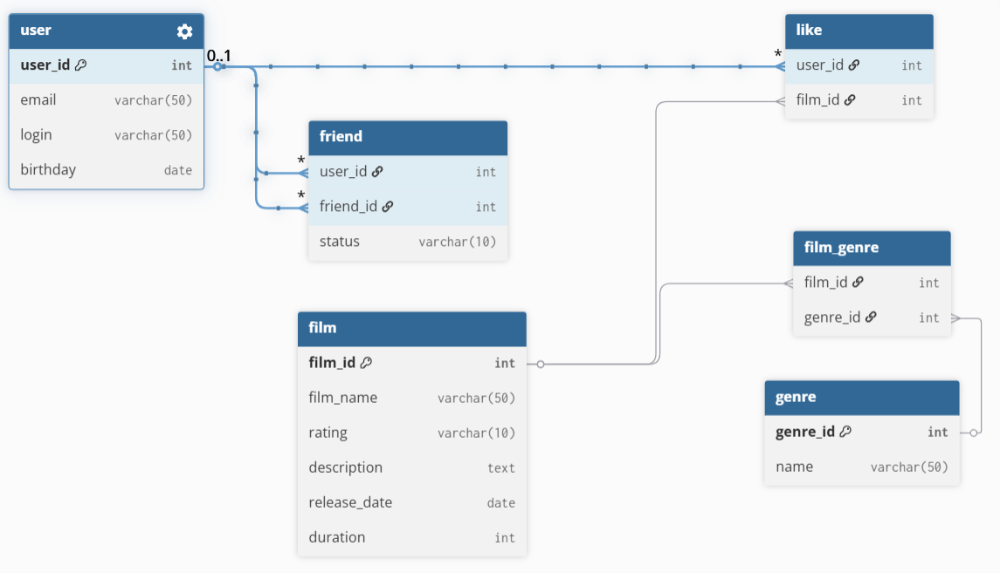

# DATABASE

## Схема базы данных:



## Примеры запросов:

1. Запрос на получение списка друзей:

```
SELECT DISTINCT login
FROM 
(
	SELECT friend_id 
	FROM friend 
	WHERE user_id = 1 AND status LIKE "accepted"
) AS friends
INNER JOIN "user" ON "user".user_id = friends.friend_id
```

2. Запрос на получение общих друзей:

```
SELECT login
FROM (
		SELECT friend_id
		FROM friend
		WHERE user_id = 1 AND status LIKE "accepted"
		INTERSECT
		SELECT friend_id
		FROM friend
		WHERE user_id = 2 AND status LIKE "accepted"
) AS common
INNER JOIN "user" ON "user".user_id = common.friend_id
```

3. Запрос на получение 10 самых популярных фильмов:

```
SELECT name
FROM film
INNER JOIN (
    SELECT 
        film_id, 
        COUNT(user_id) AS likes_count 
    FROM "like" 
    GROUP BY film_id 
    ORDER BY likes_count DESC
    LIMIT 10
) AS top_likes ON top_likes.film_id = film.film_id
```